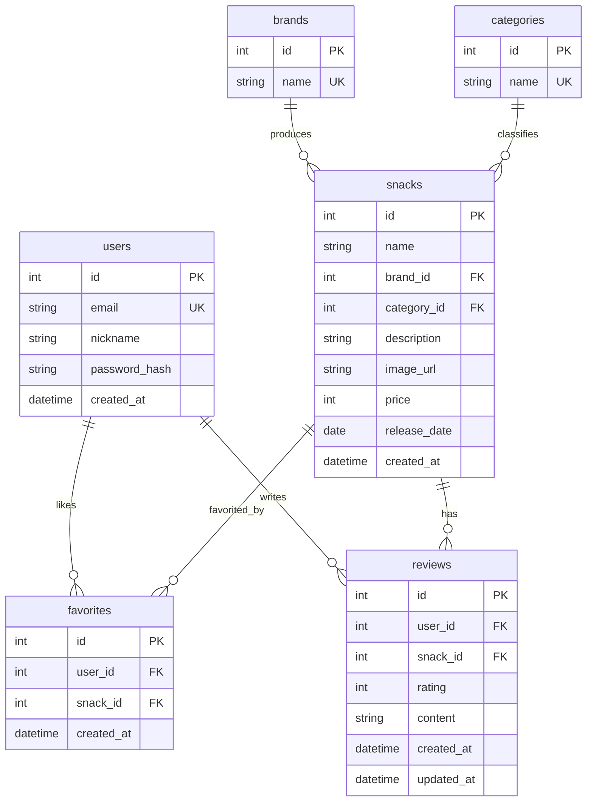

# YumYum — ERD 및 Prisma Schema

## 1. ER 다이어그램



---

## 2. 테이블 관계 설명

| 관계 | 설명 |
|------|------|
| `users` 1 : N `favorites` | 한 사용자가 여러 과자를 좋아요할 수 있다 |
| `users` 1 : N `reviews` | 한 사용자가 여러 리뷰를 작성할 수 있다 |
| `snacks` 1 : N `favorites` | 한 과자는 여러 사용자에게 좋아요될 수 있다 |
| `snacks` 1 : N `reviews` | 한 과자는 여러 리뷰를 가질 수 있다 |
| `brands` 1 : N `snacks` | 한 브랜드는 여러 과자를 생산한다 |
| `categories` 1 : N `snacks` | 한 카테고리는 여러 과자를 포함한다 |
| `users` + `snacks` 복합 유니크 | `favorites(user_id, snack_id)` — 중복 좋아요 방지 |
| `users` + `snacks` 복합 유니크 | `reviews(user_id, snack_id)` — 과자 당 리뷰 1개 제한 |

---

## 3. Prisma Schema

> 경로: `backend/prisma/schema.prisma`

```prisma
generator client {
  provider = "prisma-client-js"
}

datasource db {
  provider = "postgresql"
  url      = env("DATABASE_URL")
}

model User {
  id           Int       @id @default(autoincrement())
  email        String    @unique
  nickname     String
  passwordHash String    @map("password_hash")
  createdAt    DateTime  @default(now()) @map("created_at")

  favorites Favorite[]
  reviews   Review[]

  @@map("users")
}

model Category {
  id     Int     @id @default(autoincrement())
  name   String  @unique

  snacks Snack[]

  @@map("categories")
}

model Brand {
  id     Int     @id @default(autoincrement())
  name   String  @unique

  snacks Snack[]

  @@map("brands")
}

model Snack {
  id          Int       @id @default(autoincrement())
  name        String
  brandId     Int       @map("brand_id")
  categoryId  Int       @map("category_id")
  description String?
  imageUrl    String?   @map("image_url")
  price       Int?
  releaseDate DateTime? @map("release_date") @db.Date
  createdAt   DateTime  @default(now()) @map("created_at")

  brand     Brand     @relation(fields: [brandId], references: [id])
  category  Category  @relation(fields: [categoryId], references: [id])
  favorites Favorite[]
  reviews   Review[]

  @@map("snacks")
}

model Favorite {
  id        Int      @id @default(autoincrement())
  userId    Int      @map("user_id")
  snackId   Int      @map("snack_id")
  createdAt DateTime @default(now()) @map("created_at")

  user  User  @relation(fields: [userId], references: [id], onDelete: Cascade)
  snack Snack @relation(fields: [snackId], references: [id], onDelete: Cascade)

  @@unique([userId, snackId])
  @@map("favorites")
}

model Review {
  id        Int      @id @default(autoincrement())
  userId    Int      @map("user_id")
  snackId   Int      @map("snack_id")
  rating    Int
  content   String
  createdAt DateTime @default(now()) @map("created_at")
  updatedAt DateTime @updatedAt @map("updated_at")

  user  User  @relation(fields: [userId], references: [id], onDelete: Cascade)
  snack Snack @relation(fields: [snackId], references: [id], onDelete: Cascade)

  @@unique([userId, snackId])
  @@map("reviews")
}
```

---

## 4. 컬럼 상세 설명

### users

| 컬럼 | 타입 | 설명 |
|------|------|------|
| id | INT PK | 자동 증가 |
| email | VARCHAR UNIQUE | 로그인 식별자 |
| nickname | VARCHAR | 표시 이름 |
| password_hash | VARCHAR | bcrypt 해시 |
| created_at | TIMESTAMP | 가입일 |

### snacks

| 컬럼 | 타입 | 설명 |
|------|------|------|
| id | INT PK | 자동 증가 |
| name | VARCHAR | 과자명 |
| brand_id | INT FK | brands.id |
| category_id | INT FK | categories.id |
| description | TEXT | 상품 설명 (선택) |
| image_url | VARCHAR | 상품 이미지 URL (선택) |
| price | INT | 가격 (선택) |
| release_date | DATE | 출시일 (선택) |
| created_at | TIMESTAMP | DB 등록일 |

### favorites

| 컬럼 | 타입 | 설명 |
|------|------|------|
| id | INT PK | 자동 증가 |
| user_id | INT FK | users.id |
| snack_id | INT FK | snacks.id |
| created_at | TIMESTAMP | 좋아요 등록일 |

UNIQUE(user_id, snack_id) — 동일 과자 중복 좋아요 방지

### reviews

| 컬럼 | 타입 | 설명 |
|------|------|------|
| id | INT PK | 자동 증가 |
| user_id | INT FK | users.id |
| snack_id | INT FK | snacks.id |
| rating | INT | 별점 (1~5) |
| content | TEXT | 리뷰 내용 |
| created_at | TIMESTAMP | 작성일 |
| updated_at | TIMESTAMP | 수정일 |

UNIQUE(user_id, snack_id) — 과자 당 리뷰 1개 제한
